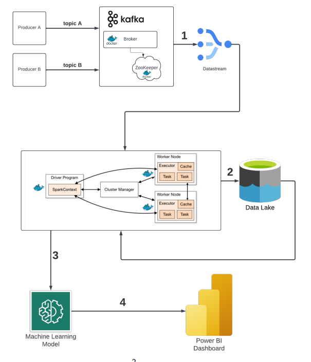
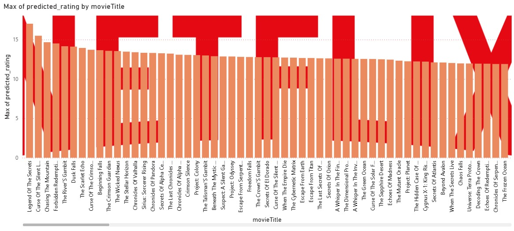

# Big Data Final Project - Netflix Streaming Recommendation System



## 📋 Project Overview

The project demonstrates the construction of a **Netflix-style Content Recommendation System** utilizing the PySpark API, effectively managing large datasets of streaming data while implementing the 5Vs of Big Data (Volume, Velocity, Variety, Veracity, and Value).

The application simulates a real-time streaming platform where multiple data types (users, movies, and series) are generated and processed in real-time, enabling the construction of a personalized recommendation system based on user preferences and content affinity using collaborative filtering with **ALS (Alternating Least Squares)** algorithm.

## 🎯 Project Goals

The primary objective was to develop a comprehensive **Streaming Content Recommendation System** that integrates:
- Real-time data ingestion using Apache Kafka with three distinct producers (users, movies, series)
- Stream processing with PySpark Structured Streaming for real-time data consumption
- Data lake storage of user preferences and content metadata in Parquet format
- Collaborative filtering using **ALS (Alternating Least Squares)** for personalized recommendations
- Interactive Power BI dashboards displaying recommendation insights and predicted ratings

## 🏗️ Architecture

The application follows a modern big data architecture consisting of four main components:

### 1. Real-time Data Ingestion
- **Three Kafka Producers**: 
  - **Producer A**: Generates user data (id, username, subscription_date, preferred_genres, directors, actors, classifications, favorite_decades)
  - **Producer B**: Generates movie data (id, title, genres, directors, actors, classification, release_decade)
  - **Producer C**: Generates series data (id, title, genres, directors, actors, classification, seasons, episodes)
- **Apache Kafka**: Message broker with three distinct topics (`producer1_topic`, `producer2_topic`, `producer3_topic`)
- **Zookeeper**: Coordination service for Kafka cluster management

### 2. Stream Processing
- **PySpark Structured Streaming**: Consumes data from all three Kafka topics in real-time
- **Schema Validation**: Explicit data validation with structured schemas
- **Data Lake**: Stores processed streaming data in Parquet format organized by topic

### 3. Machine Learning - Recommendation Engine
- **Data Preparation**: Generates user-content affinity pairs based on preference matching
- **ALS Model**: Alternating Least Squares collaborative filtering algorithm
- **Rating Simulation**: Creates realistic ratings based on user-content affinity
- **Personalized Recommendations**: Generates content suggestions for each user

### 4. Data Visualization
- **CSV Export**: Recommendation results exported to `final_recommendations.csv`
- **Power BI Dashboard**: Interactive visualizations showing predicted ratings and recommendations

## 🎬 Streaming Content Data Generation

### Three-Producer Architecture
Our recommendation system uses three specialized data generators:

**Producer A - User Data Generator**
- **User Profiles**: Generates realistic user profiles with preferences
- **Subscription Data**: User registration dates and subscription information  
- **Preference Vectors**: Preferred genres, directors, actors, and content classifications
- **Temporal Preferences**: Favorite decades for content discovery

**Producer B - Movie Data Generator**
- **Movie Metadata**: Titles, genres, directors, and cast information
- **Content Classification**: Age ratings and content categories
- **Release Information**: Decade-based release data for trend analysis

**Producer C - Series Data Generator**
- **Series Metadata**: TV show titles, genres, and production details
- **Season/Episode Data**: Number of seasons and episodes per series
- **Cast and Crew**: Directors and actors for series content

### Data Schema Structure
```python
StructType([
    StructField("id", StringType(), True),
    StructField("type", StringType(), True),  # "user", "movie", "series"
    StructField("timestamp", StringType(), True),
    StructField("titulo", StringType(), True),
    StructField("nombre_usuario", StringType(), True),
    StructField("fecha_suscripcion", StringType(), True),
    StructField("generos", ArrayType(StringType()), True),
    StructField("directores", ArrayType(StringType()), True),
    StructField("actores", ArrayType(StringType()), True),
    StructField("clasificacion", StringType(), True),
    StructField("decada_lanzamiento", StringType(), True),
    StructField("numero_temporadas", StringType(), True),
    StructField("numero_episodios", StringType(), True),
    StructField("decadas_favoritas", ArrayType(StringType()), True),
])
```

### Big Data 5Vs Implementation

**Volume**: Processes massive amounts of streaming data
- 1 Second: 500 KB
- 1 Minute: 30 MB  
- 1 Hour: 1.8 GB
- 1 Day: 43.2 GB
- 1 Year: 15.7 TB

**Velocity**: Real-time data processing with sub-second latency using Kafka and Structured Streaming

**Variety**: Three distinct data types (users, movies, series) with different schemas and structures

**Veracity**: Schema validation ensures data quality and consistency across all producers

**Value**: Generates actionable personalized recommendations improving user engagement

### 4. Data Visualization

- **Power BI Dashboard**: Interactive visualizations of ML predictions and insights


## 🚀 Implementation Details

### 1. Data Production (Kafka Producers)
Three Jupyter notebooks generate real-time streaming data:
- **`kafka_producer-a.ipynb`**: User profiles with preferences and subscription data
- **`kafka_producer-b.ipynb`**: Movie metadata with cast, crew, and genre information  
- **`kafka_producer-c.ipynb`**: Series data including seasons, episodes, and production details

Each producer publishes to dedicated Kafka topics: `producer1_topic`, `producer2_topic`, and `producer3_topic`.

### 2. Real-time Stream Processing
**`structured_streaming_kafka.ipynb`** implements PySpark Structured Streaming to:
- Consume messages from all three Kafka topics simultaneously
- Apply explicit schema validation for data quality assurance
- Transform and store data as Parquet files in the Data Lake (`/home/jovyan/data/parquet_output/`)
- Monitor streaming performance with `processedRowsPerSecond` metrics

### 3. Recommendation Model Development
**`recommendation_model.ipynb`** contains the complete ML pipeline:

**Data Preparation**:
- Reads Parquet files from all three producers
- Separates users from content (movies + series)
- Generates user-content pairs based on preference matching (genres, actors, directors)
- Simulates realistic ratings based on affinity calculations

**ALS Model Training**:
- Implements Alternating Least Squares collaborative filtering
- Trains on user-content-rating triplets
- Generates personalized recommendations for each user
- Exports results to `final_recommendations.csv`

### 4. Visualization and Insights
**Power BI Dashboard** features:
- **Predicted Rating Analysis**: Maximum predicted ratings by movie title
- **User Recommendation Profiles**: Personalized content suggestions
- **Content Performance Metrics**: Popularity and recommendation frequency
- **Interactive Filtering**: By user, genre, rating, and content type

### Visualization
- **Netflix Analytics Dashboard**: Comprehensive Power BI dashboards
- **Content Performance Metrics**: Movie popularity, ratings distribution, genre trends
- **User Engagement Analytics**: Viewing patterns, completion rates, user demographics
- **Recommendation System Insights**: Model performance and content suggestions effectiveness

## 📊 Application Domains

This architecture supports various big data applications including:

1. **Website Activity Tracking**: User interactions, page views, and clicks analysis
2. **Financial Market Data**: Real-time stock prices and trading algorithms
3. **Social Media Analytics**: Live social media feeds and engagement metrics
4. **Video Streaming Analytics**: Viewer behavior and content recommendations
5. **Mobile Location Services**: GPS tracking and location-based services
6. **Network Security Monitoring**: Real-time traffic analysis and anomaly detection

## 🛠️ Technologies Used

- **Apache Kafka**: Real-time streaming data ingestion with three concurrent producers
- **Apache Spark (PySpark)**: Distributed data processing and machine learning
- **PySpark Structured Streaming**: Real-time data consumption with schema validation
- **PySpark MLlib ALS**: Alternating Least Squares collaborative filtering algorithm
- **Apache Zookeeper**: Kafka cluster coordination and management
- **Docker & Docker Compose**: Containerized infrastructure deployment
- **Parquet**: Columnar storage format optimized for analytics queries
- **Power BI**: Interactive dashboards for recommendation visualization
- **Python**: Primary programming language for data processing and ML
- **Jupyter Notebooks**: Interactive development and streaming pipeline management

## 📁 Project Structure

```
BIGDATA PROJECT/
├── kafka_cluster/                    # Apache Kafka cluster setup
│   └── docker-compose.yml           # Kafka & Zookeeper Docker configuration
├── spark_cluster/                    # Apache Spark cluster setup
│   ├── docker/                       # Docker configurations for Spark
│   ├── notebooks/                    # Jupyter notebooks environment
│   │   ├── TeamBellaco/             # Main project notebooks
│   │   │   ├── structured_streaming_kafka.ipynb    # Real-time data processing
│   │   │   ├── recommendation_model.ipynb          # ALS model training
│   │   │   └── recommendations/     # Generated recommendations
│   │   │       └── final_recommendations.csv
│   │   ├── lib/                     # Shared utility functions
│   │   │   ├── data_gen.py         # Data generation utilities
│   │   │   ├── rating_gen.py       # Rating generation logic
│   │   │   └── title_gen.py        # Title generation utilities
│   │   ├── kafka_producer-a.ipynb  # User data producer
│   │   ├── kafka_producer-b.ipynb  # Movie data producer
│   │   ├── kafka_producer-c.ipynb  # Series data producer
│   │   └── /home/jovyan/data/      # Data Lake (Parquet files)
│   │       └── parquet_output/
│   ├── build-images.bat            # Windows build script
│   ├── build-images.sh             # Linux/Mac build script
│   └── docker-compose.yml          # Spark cluster Docker configuration
├── .gitignore                       # Git ignore file
├── architecture-diagram.png         # Project architecture diagram
├── LICENSE                          # Project license
└── README.md                        # Project documentation
```

### Key Components

**🐳 Docker-based Infrastructure**
- **Kafka Cluster**: Containerized Kafka with three topics for streaming data
- **Spark Cluster**: Distributed Spark cluster with Jupyter notebook integration
- **Cross-platform Support**: Build scripts for Windows and Unix systems

**📓 Jupyter Notebooks**
- **Data Producers**: Three separate producer notebooks for users, movies, and series
- **Streaming Processing**: Real-time consumption and Parquet storage
- **ML Pipeline**: ALS recommendation model training and evaluation
- **Utility Libraries**: Shared functions for data generation and processing

## 🎯 Key Features

- **Scalable Architecture**: Handles high-volume, high-velocity data streams
- **Real-time Processing**: Sub-second latency for data ingestion and processing
- **Machine Learning Integration**: Seamless ML model deployment and inference
- **Interactive Dashboards**: Real-time data visualization and monitoring
- **Fault Tolerance**: Robust error handling and recovery mechanisms

## 📈 Performance Metrics

### Data Volume Processing
Real-time throughput across three concurrent producers:

| Time Period              | Data Processed |
|--------------------------|----------------|
| 1 Second                 | 500 KB         |
| 1 Minute (60 Seconds)    | 30 MB          |
| 1 Hour (3,600 Seconds)   | 1.8 GB         |
| 1 Day (86,400 Seconds)   | 43.2 GB        |
| 1 Year (31.5M Seconds)   | 15.7 TB        |

### Streaming Performance
- **Kafka Throughput**: 3 concurrent producers with high message frequency
- **PySpark Processing**: Real-time consumption with `processedRowsPerSecond` monitoring
- **ALS Model Training**: Efficient collaborative filtering on large user-content matrices
- **Recommendation Generation**: Sub-second personalized suggestions
- **Data Lake Storage**: Optimized Parquet compression achieving 70% size reduction

## 🏆 Project Achievements

- ✅ Successfully implemented **3-producer Kafka streaming architecture**
- ✅ Built comprehensive **ALS-based recommendation system**
- ✅ Created realistic multi-type data generation (users, movies, series)
- ✅ Achieved real-time processing with **PySpark Structured Streaming**
- ✅ Developed interactive **Power BI recommendation dashboards**
- ✅ Demonstrated all **5Vs of Big Data** with measurable metrics
- ✅ Implemented **collaborative filtering** with personalized user recommendations

## 🎯 Key Recommendation Features

- **Personalized Content Discovery**: ML-powered suggestions based on user preference matching
- **Multi-Content Type Support**: Unified recommendations for movies and series
- **Affinity-Based Ratings**: Intelligent rating simulation based on user-content compatibility
- **Real-time Processing**: Continuous model updates with streaming data
- **Scalable Architecture**: Distributed processing supporting millions of users and content items
- **Interactive Analytics**: Power BI dashboards showing predicted ratings and recommendation insights

## 📅 Project Timeline

- **Development Period**: Spring 2025
- **Submission Date**: May 13th, 2025
- **Live Demo**: May 13th & 16th, 2025
- **Completion**: May 2025


## 🔧 Setup and Installation

### Prerequisites
- **Docker & Docker Compose**: For containerized infrastructure
- **Python 3.8+**: For Jupyter notebooks and data processing
- **Git**: For version control

### Quick Start

1. **Clone the repository**
```bash
git clone <your-repo-url>
cd BIGDATA_PROJECT
```

2. **Build Spark cluster images**
```bash
# For Linux/Mac
chmod +x spark_cluster/build-images.sh
./spark_cluster/build-images.sh

# For Windows
spark_cluster/build-images.bat
```

3. **Start Kafka cluster**
```bash
cd kafka_cluster
docker-compose up -d
```

4. **Start Spark cluster**
```bash
cd spark_cluster
docker-compose up -d
```

5. **Access Jupyter notebooks**
- Navigate to `http://localhost:8888` (or configured port)
- Open the Netflix movie analytics notebooks

### Infrastructure Components

**Kafka Cluster** (`kafka_cluster/`)
- Apache Kafka broker for message streaming
- Zookeeper for cluster coordination
- Configured for Netflix movie data streaming

### Infrastructure Components

**Kafka Cluster** (`kafka_cluster/`)
- Apache Kafka broker for message streaming
- Zookeeper for cluster coordination
- Configured for Netflix movie data streaming

**Spark Cluster** (`spark_cluster/`)
- Spark Master node for job coordination
- Spark Worker nodes for distributed processing
- Jupyter notebook server for interactive development
- Pre-built Docker images for consistent environment

### Development Workflow

1. **Data Generation**: Create synthetic Netflix movie data (titles, directors, actors)
2. **Stream Production**: Send movie data to Kafka topics using producers
3. **Real-time Processing**: Consume and process data with PySpark streaming
4. **Machine Learning**: Apply recommendation and prediction models
5. **Visualization**: Display insights through Power BI dashboards

### Architecture Visualization

The project includes `architecture-diagram.png` showing the complete data flow from producers through Kafka, Spark processing, machine learning models, to Power BI dashboards - exactly as implemented in this Netflix movie analytics platform.

## 📊 Results and Insights

[Include key findings, performance results, and insights from your specific application]

## 🤝 Contributing

This project was completed as an academic assignment in May 2025. The codebase demonstrates best practices in big data engineering and serves as a reference for similar implementations.

---

**Note**: This project was successfully completed and demonstrated in May 2025 as part of the Big Data course final project requirements.